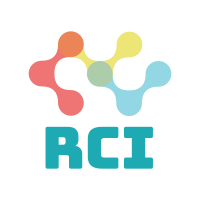

Very easy to use, C++ wrappers for runtime collection interfaces on Linux.

This library intergrates PERFECTLY with [`pfs`](https://github.com/dtrugman/pfs) - The best procfs parsing library in C++.

## Build


Run `cmake . && make`

Currently supported CMake configuration flags:

- `CMAKE_BUILD_TYPE=<Debug|Release>`: Standard CMake flags to control build type (DEFAULT: Debug)
- `BUILD_SHARED_LIBS=<ON|OFF>`: ON to compile a shared library. OFF to compile a static library (DEFAULT: ON)

You can pass any number of those to the `cmake` command: `cmake -D<CONFIG_FLAG>=<VALUE> .`

### Build using clang

If you prefer using clang, just configure the compiler while running cmake:

`CXX=<clang++> CC=<clang> cmake .`

After that, just use `make` as always.

## Requirements

- The library requires C++11 or newer
- The library aims to support Linux kernel versions >= 2.6.32. Some features are obviously supported only on newer kernels.

## Integrate

- Compile as a shared or static library.
- Add the contents of `/lib` into your link directories
- Add the contents of `/include` into your include directories.
That's it, you are good to go.

## Notes

- All APIs and function calls might throw `std::bad_alloc` exceptions when allocations of standard containers such as `std::string` fail.

## Supported collection mechanisms

### Proc Connector (Supported since v0.1)

Register with the proc connector and receive callbacks for requested events asynchronously.

List of reported events includes:
- Task fork/exec/exit events
- UID/GID changes
- SID changes
- Ptrace requests
- Comm changes
- Coredumps

## Samples

### Proc Connector

The directory `sample/proconn` contains a full blown application that registers with the proc connector and prints some of the supported events. When compiling the library, the sample application is compiled as well.

Anyway, here is all the code you need to use the proc connector to track all process events:

```
void fork_callback(fork_event event)
{
    // Handle fork events
}

void exec_callback(exec_event event)
{
    // Handle exec events
}

void exit_callback(exit_event event)
{
    // Handle exit events
}

rci::proconn::event_callbacks callbacks;
callbacks.fork = fork_callback;
callbacks.exec = exec_callback;
callbacks.exit = exit_callback;

rci::proconn pc(callbacks);
pc.run();
```
